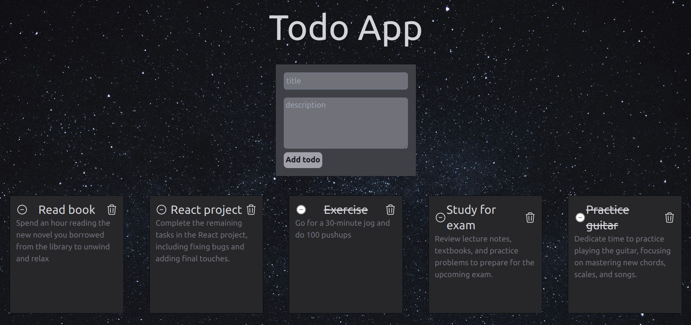

# Todo Web App

This is a simple todo web application built using React, Tailwind CSS for the frontend, and Express.js, Node.js, and MongoDB for the backend.




## Features

- **Create Todo:** Users can add new todos with a title and description.
- **Mark as Completed:** Users can mark todos as completed.
- **Delete Todo:** Users can delete todos.
- **Persistent Data:** Todos are stored in a MongoDB database, ensuring data persistence.

## Technologies Used

- **Frontend:**
  - React: JavaScript library for building user interfaces.
  - Tailwind CSS: Utility-first CSS framework for styling.
- **Backend:**
  - Express.js: Web application framework for Node.js.
  - Node.js: JavaScript runtime for server-side development.
  - MongoDB: NoSQL database for storing todo data.

## Installation

1. Clone the repository:

   ```bash
   git clone https://github.com/praneeth-ayla/todo-app/
2. Install dependencies for both frontend and backend:

   ```bash
   cd frontend
   npm install
   cd ../backend
   npm install
   ```

3. Configure MongoDB:
   - Make sure MongoDB is installed and running on your system.
   - Update the MongoDB connection URL in `backend/config/db.js` if necessary.

4. Start the backend server:

   ```bash
   cd backend
   node index.js
   ```

5. Start the frontend development server:

   ```bash
   cd frontend
   npm run dev
   ```

6. Access the application
  - Frontend: `http://localhost:5173`
  - Backend: `http://localhost:3000`

## Usage

- **Adding Todo:** Enter a title and description in the input fields and click the "Add Todo" button.
- **Completing Todo:** Click the checkbox next to a todo to mark it as completed.
- **Deleting Todo:** Click the delete icon next to a todo to delete it.

## Contributing

Contributions are welcome! Feel free to open issues or pull requests.

